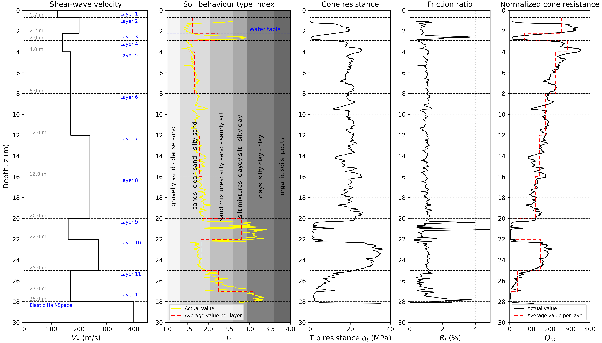

# geosite

> Felipe Kuncar, Chris de la Torre

A collection of Python classes and functions designed to streamline the development of site response models.

# Features

1. CPTu class - Processes CPT data and estimates key geotechnical parameters such as shear-wave velocity, relative density, and friction angle.
2. Vs class - Estimates geotechnical parameters from a shear-wave velocity profile, including unit weight and normalized SPT blow count.
3. PDMY02 class - Estimates parameters for the OpenSees PDMY02 constitutive model, based on Karimi & Dashti (2016).
4. Functions to compute modulus reduction and damping curves based on the Darendeli (2001) model and the Yee et al. (2013) procedure.
5. Functions to generate input files for 1D site-response analysis using OpenSees and PySeismoSoil.

